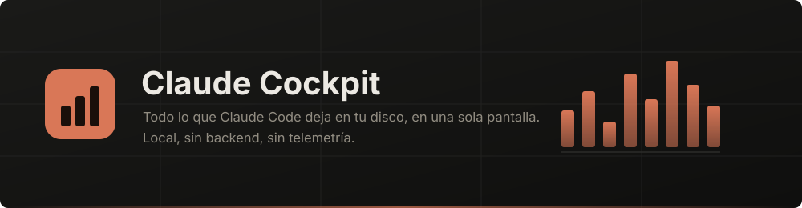
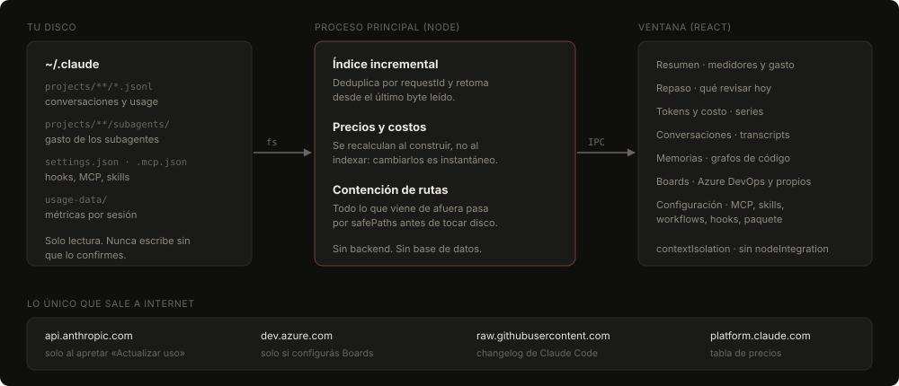

<p align="center">
  
</p>

<p align="center">
  
  
  
  
  
</p>

<p align="center">
  <a href="README.md">Español</a> · <b>English</b>
</p>

---

Claude Code leaves a lot of information on your disk: every conversation, the
`usage` block of every request, what your subagents spent, memories, MCP
servers, hooks. You just have no way to look at it.

**Claude Cockpit reads all of that and shows it to you.** It runs on your
machine, has no server, sends no telemetry, and never writes to your Claude Code
configuration without asking first.

## Install

Download the installer from
[Releases](https://github.com/lucabaello1998/claude-cockpit/releases/latest) and
run it. No Node, no commands.

> Windows will show a SmartScreen warning — the installer isn't code-signed
> (certificates cost money). *More info → Run anyway*, or build it yourself with
> the steps below.

### From source

```bash
npm install
npm start          # build and open the app
```

| Command | What it does |
|---|---|
| `npm run dev` | Vite + Electron with hot reload |
| `npm start` | build and open the app |
| `npm run dist` | NSIS installer in `release/` |
| `npm run audit` | the security and correctness suite |
| `npm run icon` | regenerate `build/icon.ico` |

Requires **Node 20+**. Tested on Windows. Nothing in the code is
platform-specific except packaging, which currently only produces a Windows
installer.

> If you run it from a Claude Code terminal, use `npm start` rather than the
> `.exe` directly: that terminal sets `ELECTRON_RUN_AS_NODE=1` and Electron
> starts as plain Node. `scripts/launch.cjs` strips that variable.

## First run

If Claude Code isn't installed on the machine, or is installed but never signed
in, the app says so and walks you through it instead of opening onto empty
panels. It re-checks on its own every few seconds, so you can leave the window
open while you run the command.

To be clear about what it can't do: **Claude Cockpit cannot sign you in.** The
Claude Code login is an OAuth flow run by the CLI, which stores the token in
your folder. This app only reads it, and only when you ask it to refresh usage.

## What you get

| Panel | What it's for |
|---|---|
| **Overview** | 5 h / 7 day limit meters, spend by period, project and model |
| **Daily review** | Once a day: what you left open, how your spend compares to last week, and what shipped in Claude Code since your version |
| **Tokens & cost** | Series by day or hour, model breakdown, how much the cache saved you |
| **Conversations** | Full transcripts, with subagents accounted for separately |
| **Memories** | What Claude stored, plus code graphs if you have a repo indexed |
| **Boards** | Azure DevOps work items filtered by level, sprint and assignee, plus your own Kanban boards with an Epic → Feature → PBI → Task hierarchy |
| **Settings** | Editable MCP servers, skills, workflows, hooks, plugins and projects, and an exportable package to move your setup to another machine |

None of this requires an MCP server. **With none configured, everything that
comes from reading files works exactly the same.** Missing ones are listed under
*Settings → Requirements*, which explains what each one enables, configures it,
and tests it against the real server.

## Why the numbers are right

This is the hard part, and the reason the project exists. Building a dashboard
is easy; building one that doesn't lie is less so. Four things you have to get
right that aren't obvious:

**The transcript rewrites the same row while streaming.** The same `requestId`
shows up several times with cumulative usage. Count every row and your spend
comes out roughly **4× inflated**. You have to dedupe by `requestId` and keep
the last one.

**Subagents live in separate files.** They're under
`projects/<proj>/<sessionId>/subagents/**/*.jsonl`, not in the main transcript.
In one real measurement that was **$154 out of $604** simply missing.

**Days are local, not UTC.** Bucketing by UTC pushes everything you do after
9 PM in Argentina into the next day.

**Caching has its own economics.** A cache read costs 0.1× of input; writing it
costs 1.25× (5 min) or 2× (1 hour). Without that, neither the cost nor the
savings add up.

## How it's built

<p align="center">
  
</p>

Indexing is **incremental**: a `.jsonl` only grows at the end, so parsing
resumes from the last byte read instead of re-reading the whole file. On a 56 MB
transcript that's the difference between **231 ms and 10 ms** every time the
session writes a line.

Costs are computed when the snapshot is built, not at index time, so changing
the pricing table shows up instantly without reindexing.

## Security

The app reads personal files and can write Claude Code configuration, so the
security model isn't an afterthought:

- **Path containment.** Anything coming from the renderer or an imported package
  goes through `safePaths` before touching disk. It compares with
  `path.relative`, not `startsWith` — `skills-malicious` starts with `skills`.
- **Symlinks are resolved.** `resolve()` doesn't follow them, so a link inside
  `hooks/` could redirect a write outside `~/.claude`.
- **MCP servers launch without shell reinterpretation.** On Windows the command
  is validated and unquoted while every argument is quoted, so an `&&` travels
  as text, not as an operator.
- **Third-party HTML is flattened to text in the main process.** Azure DevOps
  descriptions and release notes were written by someone else; the renderer
  never interprets them.
- **Importing a package** always takes a backup first, shows a preview, and asks
  per item. It never marks a project as trusted — that decision stays yours in
  Claude Code.

```bash
npm run audit
```

287 checks. Not smoke tests: they **actively try to exploit every write
surface** (traversal, symlinks, command injection, prototype pollution, negative
indices) and verify it stays contained. The suite grew out of real holes that
were found and fixed.

## What leaves your machine

Nothing on its own. Only these four destinations, and always because you asked:

| Destination | When |
|---|---|
| `api.anthropic.com/api/oauth/usage` | Only when you press **Refresh usage**. The token is read at that moment, never stored or copied |
| `dev.azure.com` | Only if you configured Boards, with your own PAT |
| `raw.githubusercontent.com` | The public Claude Code changelog, for the daily review |
| `platform.claude.com` | The pricing table, only when you press **Fetch current prices** |

## About the dollar figures

**Token counts are exact** — they come straight from the transcript. Dollar
amounts are an **estimate at public API rates**. If your account is a
subscription you aren't billed per token, so they're useful for comparing
sessions against each other, not as an invoice. You can turn them off and see
tokens only.

## Publishing a release

The app updates itself from GitHub releases:

1. Bump `version` in `package.json`.
2. `npm run dist` — produces the installer, its `.blockmap` and **`latest.yml`**
   in `release/`. That last file is the metadata the updater reads.
3. Create the release tagged `v<version>` and **upload all three**. Without
   `latest.yml` the app never learns there's anything new.

With `GH_TOKEN` set, `npx electron-builder --publish always` does step 3 for you.

The updater **never installs anything on its own**: it tells you, shows the
release notes, and you choose when to download and when to restart.

## License

All rights reserved. The source is here so you can read it, but no license to
use, copy, modify or distribute is granted.

---

<p align="center">
  <sub>Built to understand where my time and money were going with Claude Code.</sub>
</p>
